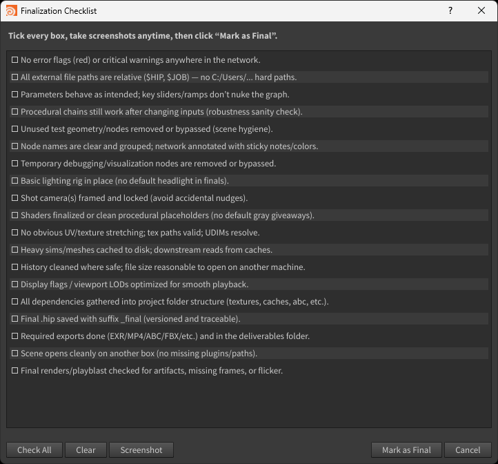

# Finalization Checklist (Houdini)
**Type:** Shelf tool  
**Purpose:** Make “final” mechanical, not emotional — a scrollable PySide2 checklist with helper actions (e.g., viewport screenshot) so you can ship with confidence.

## Features
- Word-wrapped, scrollable checklist (Qt/PySide2)
- One-click **Viewport Screenshot** helper
- Sensible defaults; easy to tweak in Python
- Lightweight, no external deps

## Install
**Option A — via .shelf**
1. Copy `src/finalization-checklist.shelf` to your Houdini shelves folder:  
   - Windows: `%USERPROFILE%\Documents\Houdini20.5\toolbar\`
2. In Houdini: *Shelves* → *New Shelf* → *Load* (or restart Houdini) → add the tool button.

**Option B — manual script**
- Copy `src/finalization-checklist.py` into a Python shelf tool and set the icon to `src/icon/check_icon.png`.

## Usage
1. Click **Finalization Checklist** on the shelf.
2. Tick items as you complete them; long items word-wrap.
3. Optional: use **Screenshot** to capture the viewport and save next to your HIP.
4. “Done” = When all required boxes are checked — ship it.

## Files
- `src/finalization-checklist.shelf` — shelf definition (XML).
- `src/finalization-checklist.py` — PySide2 UI.
- `src/icon/check-icon.png/` 0r `src/icon/checklist-icon.png/` — button icon.
- `screenshots/ui.png` — UI

## Versioning & Releases
- Current version: see `./VERSION`.
- Tags follow: `finalization-checklist-vX.Y.Z`.
- Download packaged files from the GitHub **Releases** page for this tag.

## Support
- **Bugs / features:** open a **GitHub Issue** in this repo (include “finalization-checklist” in the title).

## License
MIT © Hani Jahan — see `LICENSE`.
