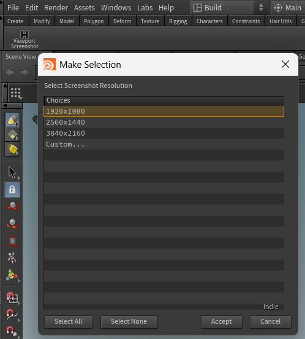

# Viewport Screenshot (Houdini)
**Type:** Shelf tool  
**Purpose:** One-click, high-resolution screenshots of the active Houdini viewport — saved automatically with a timestamp in your scene’s folder.

---

## Features
- Single-click capture of the current viewport
- Saves to `$HIP/screenshots` (auto-creates the folder if needed)
- Filenames include HIP name + timestamp
- When run, prompts you to select a resolution (default: 1920×1080) or enter a custom size.
- Works with the current frame only (fast capture)

## Install
**Option A — via `.shelf` (recommended)**
1. Copy `./src/ViewportScreenshot.shelf` to your Houdini shelves folder:
   - **Windows:** `%USERPROFILE%\Documents\HoudiniXX.X\toolbar\`
   - **Linux:** `~/houdiniXX.X/toolbar/`
   - **macOS:** `~/Library/Preferences/Houdini/XX.X/toolbar/`
2. Restart Houdini or load the shelf manually.
3. Add **Viewport Screenshot** button to a shelf.

**Option B — manual shelf tool**
1. Create a new Python shelf tool.
2. Paste the contents of `./src/viewport_screenshot.py`.
3. (Optional) Set icon to `./src/icon/viewport.png`.

## Usage
1. Open the scene and go to the desired frame/view.
2. Click **Viewport Screenshot** on your shelf.
3. Screenshot is saved to `$HIP/screenshots` as: `<hipname>_YYYYMMDD_HHMMSS.jpg`

## Files
src/
- ViewportScreenshot.shelf # Shelf definition (XML)
- viewport_screenshot.py # Python script
- icon/viewport.png # Shelf icon
- screenshots/ui.png # Example screenshot of the shelf button
- VERSION

## Versioning & Releases
- Current version: see `./VERSION`.
- Tags follow: `viewport-screenshot-vX.Y.Z`.
- Ready-to-use builds in the GitHub **Releases** page for each tag.

## Support
- **Bugs / features:** open a GitHub Issue in this repo and include “viewport-screenshot” in the title.

## License
MIT © Hani Jahan — see `LICENSE`.